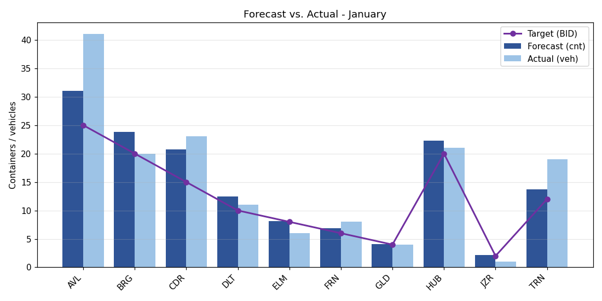
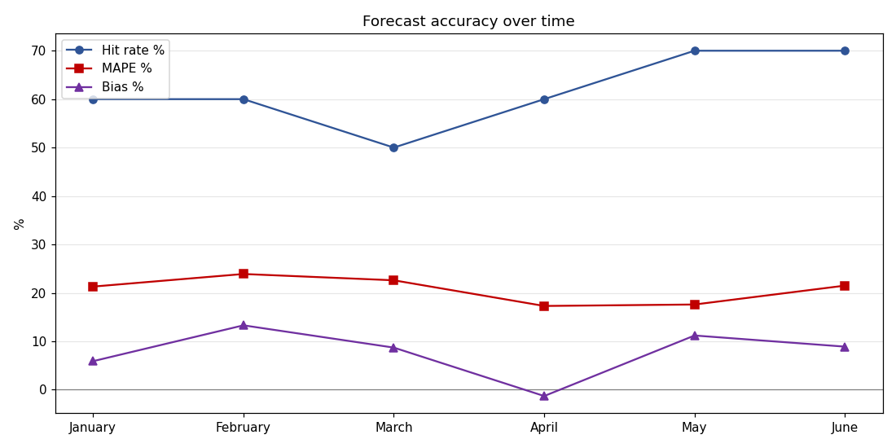

[English](README.md) | [Português](README.pt-BR.md)

# Previsto vs. Real: aderência de embarques de exportação

Um pipeline de dados que responde a uma pergunta recorrente de supply chain: **o quanto a
previsão de cada mercado de exportação bateu com o que foi de fato embarcado?** Ele ingere três
fontes de planilha bagunçadas, limpa e reconcilia, aplica as regras de negócio e produz KPIs de
acurácia da previsão, gráficos e um relatório Excel formatado.

> **Contexto.** Esta é uma destilação anonimizada e autocontida de uma análise mensal que
> construí para uma operação real de exportação. O original é um conjunto de scripts Python que
> leem as planilhas reais de previsão e carregamento da equipe. Este repositório reproduz a
> **lógica e os desafios de dados** com mercados fictícios e dados sintéticos reproduzíveis, sem
> destinos, clientes ou valores reais.

📓 **O passo a passo narrado está em [`notebooks/forecast_vs_actual.ipynb`](notebooks/forecast_vs_actual.ipynb)**, que renderiza com gráficos e tabelas direto no GitHub.

## O problema

Todo mês, os planejadores preveem quanto vai embarcar para cada mercado (em pallets), e à parte
um log de carregamento registra o que realmente saiu (em veículos). Para julgar a aderência é
preciso reconciliar duas fontes que não se alinham:

- **Unidades diferentes.** A previsão é em pallets, o real é em veículos. Um container comporta
  22 pallets, então pallets previstos viram uma contagem comparável de containers.
- **Layouts diferentes.** Os primeiros meses ficam em uma planilha (uma aba por mês, valores
  deslocados sob linhas de título); meses posteriores chegam como arquivos separados com o
  cabeçalho na linha 5 e uma coluna de mês *nomeada dinamicamente*; o log de carregamento é uma
  linha por veículo.
- **Chaves bagunçadas.** O log é digitado à mão, então o mesmo mercado aparece com apelidos e
  erros de digitação, e vários mercados de baixo volume precisam ser consolidados em uma única
  rota "HUB". Rotas rodoviárias têm de ser excluídas por completo.

Fazer isso à mão todo mês é lento e sujeito a erro. Este pipeline transforma tudo em um comando.

## Pipeline

```
 3 arquivos fonte           ingestão              transformação            análise             relatório
 ┌──────────────┐   ┌──────────────────┐   ┌──────────────────┐   ┌───────────────┐   ┌──────────────┐
 │ geral  xlsx  │   │ lê cada layout   │   │ normaliza nomes  │   │ viés / MAPE / │   │ Excel (gráf. │
 │ mensal xlsx  │──▶│ em DataFrames    │──▶│ exclui rodoviár. │──▶│ hit rate /    │──▶│ combo) +     │
 │ log de carga │   │ longos e limpos  │   │ agrupa HUB       │   │ desvios       │   │ PNGs         │
 └──────────────┘   └──────────────────┘   │ pallets → cont.  │   └───────────────┘   └──────────────┘
                                            └──────────────────┘
```

Cada etapa é um módulo próprio (`src/ingest.py`, `src/transform.py`, `src/analysis.py`,
`src/report.py`) orquestrado por `pipeline.py`, o mesmo formato de um job de ETL de produção.

## Regras de negócio

- **Container = pallets / 22.** Pallets previstos viram contagem comparável de containers.
- **Diferença = real − previsto.** O **Alvo (BID)** é a meta mensal por mercado.
- **Consolidação HUB.** Rotas de baixo volume são somadas em um único mercado `HUB`.
- **Rodoviário excluído.** Apenas rotas marítimas.
- **Normalização de nomes.** Nomes digitados à mão no log voltam aos códigos canônicos.

## KPIs

| KPI | Significado |
| --- | --- |
| **Viés %** | super ou subdimensionamento sistemático (Σreal − Σprevisto) |
| **MAPE %** | erro percentual absoluto médio, o tamanho típico do erro |
| **Hit rate %** | parcela de rotas que ficaram dentro de ±20% da previsão |

## Resultados (execução sintética inclusa)

Da execução incluída (`python pipeline.py`, 80 SKUs sintéticos em 10 mercados):

```
Mês         Previsto   Real     Viés%   MAPE%    Hit%
January        145.4      154     5.9    21.3    60.0
February       121.8      138    13.3    23.9    60.0
March          123.2      134     8.7    22.6    50.0
April          124.7      123    -1.3    17.3    60.0
May            119.6      133    11.2    17.6    70.0
June           123.0      134     8.9    21.5    70.0
GERAL          757.6      816     7.7    20.7    61.7
```

A operação **embarca cerca de 8% a mais do que prevê** em média, e dois mercados (AVL, TRN) são
os super-embarcadores persistentes que puxam a maior parte do gap. É exatamente o tipo de achado
que permite ao planejador corrigir a próxima previsão.

**Previsto vs. real por mercado (janeiro):**



**Acurácia ao longo do tempo:**



## Como rodar

```bash
pip install -r requirements.txt
python pipeline.py          # gera os dados, roda a análise, escreve em output/
```

As saídas ficam em `output/`: `forecast_vs_actual.xlsx` (uma aba de comparação por mês com
gráficos combo, mais um resumo de KPIs) e `output/charts/*.png`.

Para explorar de forma interativa, abra `notebooks/forecast_vs_actual.ipynb` (ou reconstrua-o em
modo headless com `python build_notebook.py`).

## Estrutura do projeto

```
src/config.py        Mercados, agrupamento hub, exclusão rodoviária, metas, apelidos
src/sample_data.py   Arquivos fonte sintéticos reproduzíveis (os 3 layouts reais)
src/ingest.py        Lê cada layout em DataFrames longos e limpos
src/transform.py     Regras de negócio + a tabela de comparação
src/analysis.py      KPIs de acurácia (viés, MAPE, hit rate, desvios)
src/report.py        Excel formatado (openpyxl) + gráficos matplotlib
pipeline.py          CLI de ponta a ponta
notebooks/           Análise narrada (executada, com saídas)
```

## Tecnologias e conceitos

Python · pandas / numpy · ETL multi-fonte (layouts Excel heterogêneos, detecção dinâmica de
coluna, normalização de chaves fuzzy) · métricas de acurácia de previsão (bias, MAPE, hit rate)
· visualização com matplotlib · geração de relatório com openpyxl · Jupyter.

## Possíveis extensões

- Sugestão de correção de viés por mercado em janela móvel.
- Bandas de confiança e limites de controle na tendência de acurácia.
- Trocar o gerador sintético por uma fonte de banco de dados ou API real.

## Licença

MIT
